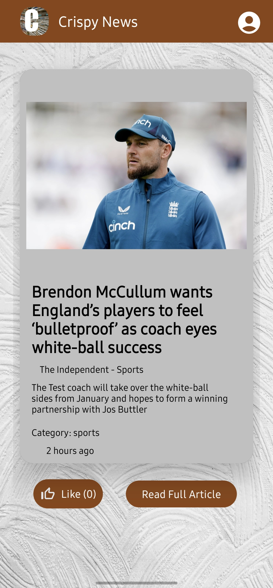
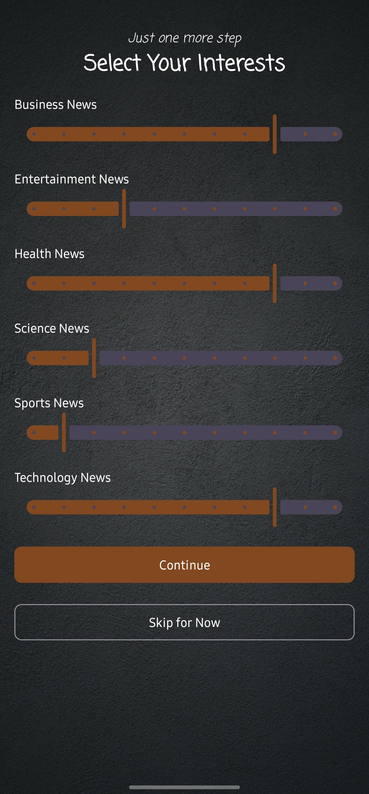

# CrispyNews - Personalized News Android Application

## Overview
CrispyNews is a personalized news app designed to deliver customized news articles based on user preferences and behavior. It utilizes a **Q-Learning** model to learn user interests and adjust content recommendations in real-time. The project consists of two components: the **Newsync App**, which fetches news from external sources, and the **CrispyNews App**, which delivers personalized content to the users.

## Screenshots

  
  
  

## Key Features

### Newsync App
- **API Integration**: Fetches news from the [MediaStack API](https://mediastack.com/) using a country filter for the UK.
- **Automated Fetching**: The app makes API calls every two hours to retrieve new articles.
- **Cloud Storage**: Fetched articles are stored in **Firebase Firestore** for later use by the CrispyNews app.

### CrispyNews App
- **Personalized Newsfeed**: Articles are fetched from Firebase and displayed in a vertical swiping **ViewPager** with fragment-based UI for easy navigation.
- **Q-Learning Model**: 
  - **State**: Represents the user's interest in seven news categories [General, Technology, Science, Sports, Health, Business, Entertainment] and the time of day (Morning, Afternoon, Evening, Night).
  - **Action**: Decides which category to recommend next based on user preferences.
  - **Reward System**: Rewards are calculated based on user interactions:
    - +0.075 for liking an article
    - +0.05 for reading more
    - -0.01 if the user spends less than 3 seconds on the article
  - **Exploration vs. Exploitation**: Uses an **ε-greedy policy** (epsilon=0.9) to either explore new recommendations or exploit known interests.
- **Data Persistence**: Local updates to the Q-table and user interests are synced to **Firebase Firestore** when the activity closes.

## Q-Learning Model Details
- **State Representation**: 
  - User interest in each category is rated between 0 and 1, classified into three ranges: low (0-0.33), medium (0.33-0.66), and high (0.66-1).
  - The time of day is divided into four segments: Morning, Afternoon, Evening, and Night.
  - This results in 8748 possible states (3^7 categories × 4 times of day).
  
- **Action**: Recommends one of the seven news categories.

- **Reward**: Based on user interactions, rewards help fine-tune the recommendations to match user preferences.

- **Hyperparameters**:
  - **Alpha (Learning Rate)**: 0.1
  - **Gamma (Discount Factor)**: 0.9
  - **Epsilon (Exploration Rate)**: 0.9

## Technologies Used
- **Android Development**: Java, Android SDK
- **Backend**: Firebase Firestore for cloud data storage
- **API Integration**: MediaStack API for news articles
- **Machine Learning**: Q-Learning algorithm for recommendation engine
- **UI/UX**: Vertical ViewPager with fragment-based swiping interface for article display

## Setup Instructions
1. Clone the repository: `git clone https://github.com/Eminemvarun/CrispyNews.git`
2. Open the project in Android Studio.
3. Sync project with Gradle files.
4. Run the `Newsync` app to fetch and store news articles.
5. Run the `CrispyNews` app to experience personalized news recommendations.

## Skills Demonstrated
- **Android Development**: Building and structuring a modern Android application with ViewPager and fragments.
- **Reinforcement Learning**: Implementing a Q-Learning model for content recommendations.
- **Firebase Integration**: Efficient use of Firebase Firestore for real-time data storage and retrieval.
- **API Handling**: Seamless integration with third-party APIs for data fetching and storage.
- **Data Persistence**: Syncing user data and model updates between local storage and the cloud.

## Future Enhancements
- **Enhanced User Profiles**: Introduce user login and multiple Q-tables for individual users.
- **Push Notifications**: Notify users of breaking news based on their interests.
- **Advanced Analytics**: Provide users with insights into their news-reading habits.
- **Dark Mode**: Allow users to switch to dark mode for better readability.

## License
This project is licensed under the MIT License - see the LICENSE file for details.
